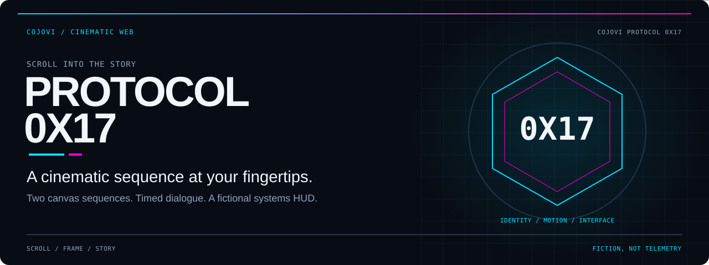
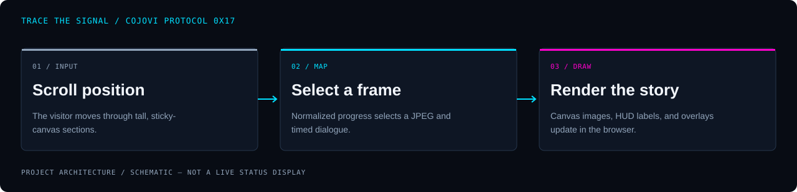

<!-- COJOVI / SIGNAL — Protocol 0X17 project edition. Keep with readme-assets/. -->
<a name="top"></a>

<p align="center">
  
</p>

<h1 align="center">Cojovi Protocol 0X17</h1>

<p align="center">
  <strong>Turn a scroll into a cinematic sequence.</strong><br>
  A single-page Cojovi showcase with canvas animation, timed dialogue, and a fictional systems HUD.
</p>

<p align="center">
  
</p>

<p align="center">
  <a href="#overview">Overview</a> ·
  <a href="#architecture">Architecture</a> ·
  <a href="#quickstart">Quickstart</a> ·
  <a href="#configuration">Configuration</a> ·
  <a href="#validation">Validation</a> ·
  <a href="#security">Boundaries</a>
</p>

---

<a name="overview"></a>
## `> meet_0X17`

**Cojovi Protocol 0X17 is a scroll-driven portfolio proof of concept—not a networking protocol or an agent runtime.** Two image sequences turn scroll position into canvas frames, while dialogue cards, progress indicators, and HUD labels tell the story.

The home page moves through **Hero → Cinematic Reveal → Systems Nominal → Footer**. Next.js provides the page shell; the animation runs in the browser.

| Scrub | Tell | Tune |
| :--- | :--- | :--- |
| Two 169-frame JPEG sequences drawn on sticky canvases. | Timed dialogue and story beats over a fictional diagnostic interface. | Source-level timing, focal points, mobile crops, and visual tokens. |

> [!IMPORTANT]
> **The diagnostics are part of the fiction.** Telemetry rows are hardcoded, the hero power readout is calculated from scroll progress, and footer archive links are placeholders. There is no telemetry service, API route, database, or authentication flow in this revision.

<a name="architecture"></a>
## `> trace_the_frames`

<p align="center">
  
</p>

```text
Scroll position
      ↓
Section progress + frame index
      ├─ local JPEG sequence → Canvas 2D
      ├─ dialogue / beat timing → overlay cards
      └─ progress → HUD text and bars
```

[Hero](src/components/sections/Hero.tsx) and [CinematicReveal](src/components/sections/CinematicReveal.tsx) each preload their own frame set. Passive scroll listeners schedule updates with `requestAnimationFrame`; drawing uses cover-style cropping with separate mobile focal points.

[Lenis](src/components/providers/SmoothScrollProvider.tsx) smooths wheel scrolling. [Framer Motion wrappers](src/components/ui/AnimatedSection.tsx) animate the systems section into view. This is **2D canvas playback**, not a WebGL scene or a video player.

<a name="quickstart"></a>
## `> bring_it_online`

**Prerequisites:** Git, npm, and Node.js satisfying the locked Next.js package's `>=20.9.0` requirement. Use a maintained Node release meeting that floor. The private package identifier remains **`iron-man`** in [package.json](package.json); the repository and current interface are Protocol **0X17**.

### 1. Get the runtime source and assets

```bash
git clone --depth 1 --filter=blob:none --sparse \
  https://github.com/cojovi/Cojovi_Protocol_0X17.git
cd Cojovi_Protocol_0X17
git sparse-checkout set src public
npm ci
```

This selects the app and public assets without checking out the separate `graphic/` media archive. The public media still needs to download; a source-only checkout without the frame directories cannot display the sequences.

### 2. Start a local-only development server

```bash
# Invoke the installed Next CLI directly for an explicit loopback binding.
npm exec -- next dev --hostname 127.0.0.1
```

Open **[http://localhost:3000](http://localhost:3000)**, wait for the frame-loading overlays, then scroll through both sequences.

> [!WARNING]
> The repository's `npm run dev` script binds to **all network interfaces**. Use the loopback command above for local work; do not expose the development server publicly.

### 3. Build and serve when ready

```bash
npm run build
npm run start -- --hostname 127.0.0.1
```

The layout imports Geist through `next/font/google`, so font retrieval can require network access during the build. There is no static-export configuration in [next.config.ts](next.config.ts); do not assume copying source files to a static host will run this app.

<a name="configuration"></a>
## `> tune_the_sequence`

No application environment variables or provider credentials are referenced by the audited source. Configuration lives in TypeScript and CSS.

| Edit | Source of truth |
| :--- | :--- |
| Hero dialogue, frame count, fade timing, and crop | [src/lib/hero.ts](src/lib/hero.ts) |
| Cinematic beats, frame count, and crop | [src/lib/cinematic.ts](src/lib/cinematic.ts) |
| Colors, card surfaces, and scroll-section heights | [src/app/globals.css](src/app/globals.css) |
| Page title, description, fonts, and metadata base | [src/app/layout.tsx](src/app/layout.tsx) |
| Wheel smoothing and touch behavior | [SmoothScrollProvider](src/components/providers/SmoothScrollProvider.tsx) |
| Display-only telemetry values | [SystemsNominal](src/components/sections/SystemsNominal.tsx) |

### Frame contract

- Hero frames live in [public/frames/](public/frames/); the second sequence uses [public/frames2/](public/frames2/).
- Each directory contains `frame_0001.jpg` through `frame_0169.jpg` at the audited revision.
- Keep the four-digit naming pattern and update the corresponding frame-count constant when replacing a sequence.
- Dialogue and beat `show` / `hide` values use normalized scroll progress from `0` to `1`.
- Tune desktop and mobile focal points separately; the components apply extra mobile scaling.

The `CINE_INTRO_FADE_END` export is not consumed by the cinematic component. Its heading crossfade is controlled in the component itself.

### Before deployment

Set `metadataBase` in the layout to your own public origin; it currently points at a local development origin. Review the footer's `#` links, metadata, asset rights, and intended host before publishing. Turbopack and PostCSS both pin resolution to the project directory in their configuration files.

<a name="usage"></a>
## `> follow_the_story`

1. Scroll the hero to advance the first frame sequence and reveal dialogue cards.
2. Continue into the cinematic section for the second sequence and heading crossfade.
3. Use **Engage** or **Open diagnostics** to jump to the fictional systems panel.
4. **Archive** in the navbar jumps to the footer; it does not open a separate archive application.

The application's section IDs are `cinematic`, `systems`, and `footer`. The only page route in the audited tree is `/`.

<a name="validation"></a>
## `> check_the_playback`

Run the repository's checks in a complete runtime checkout:

```bash
npm run lint
npm run build
```

There is no `test` script or tracked automated test suite. **Builds and tests were not run for this documentation-only task.**

### Manual acceptance checklist

- [ ] Both frame sets load without missing-image requests.
- [ ] Scroll down and back up; frames and overlays stay in sync.
- [ ] Resize between desktop and mobile widths and check cropping.
- [ ] Test keyboard navigation, readable contrast, and accessible content.
- [ ] Review reduced-motion behavior; no explicit reduced-motion branch is implemented in the audited animation code.
- [ ] Check loading time and memory use on a constrained device.
- [ ] Replace placeholder destinations and update production metadata.

**A completed loading bar does not prove every image loaded.** The preload handlers count both successful and failed image requests toward completion; failed frames are skipped by the drawing guard. Check network errors if the canvas appears blank or holds a previous image.

<a name="source-map"></a>
## `> explore_the_source`

| Path | Role |
| :--- | :--- |
| [src/app/page.tsx](src/app/page.tsx) | Home-page composition. |
| [src/components/sections/](src/components/sections/) | Two canvas sequences, systems panel, and footer. |
| [src/components/ui/](src/components/ui/) | Navigation, motion wrappers, badges, and HUD corners. |
| [src/lib/](src/lib/) | Frame paths, timing data, and crop constants. |
| [public/](public/) | Browser-served frame sequences and additional media. |
| [graphic/](graphic/) | Separate media archive; not required by the page's frame-path helpers. |
| [package.json](package.json) | Actual executable scripts and dependency declarations. |
| [AGENTS.md](AGENTS.md) | Guidance for framework changes; [CLAUDE.md](CLAUDE.md) refers to it. |

[CURSOR.md](CURSOR.md) contains historical Iron Man / Devini notes alongside later Cojovi updates. Some old copy, paths, and configuration descriptions no longer match the current source; use the implementation as the authority.

<a name="security"></a>
## `> keep_it_deliberate`

**Treat the page as a visual showcase, not an operational status board.** No secrets are needed for the current UI. Keep future credentials out of client components, public assets, and committed configuration.

Both sequences preload on mount, so frame size and count affect initial network and memory cost. There is no implemented fallback story for failed images or an explicit reduced-motion mode; assess those before presenting the experience broadly.

### Attribution and license

The current interface identifies **cojovi.com / Protocol 0X17**, and its footer labels the work a proof of concept. Historical design context remains in the repository documentation; this README does not establish ownership of every bundled asset.

**No repository license file was found at the audited revision.** Public availability is not a blanket reuse grant. Confirm code and media permissions with the rights holders before redistribution or commercial use, and retain applicable third-party notices.

---

<p align="center">
  
</p>

<p align="center">
  <strong>One scroll. Two sequences. A story in every frame.</strong><br>
  <sub>A <a href="https://github.com/cojovi">Cody / cojovi</a> project · <a href="https://cojovi.com">cojovi.com</a><br>
  Protocol 0X17 · Presented in COJOVI / SIGNAL.</sub>
</p>

<p align="center"><a href="#top">↑ Back to the signal</a></p>
